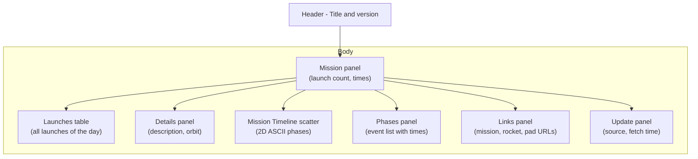
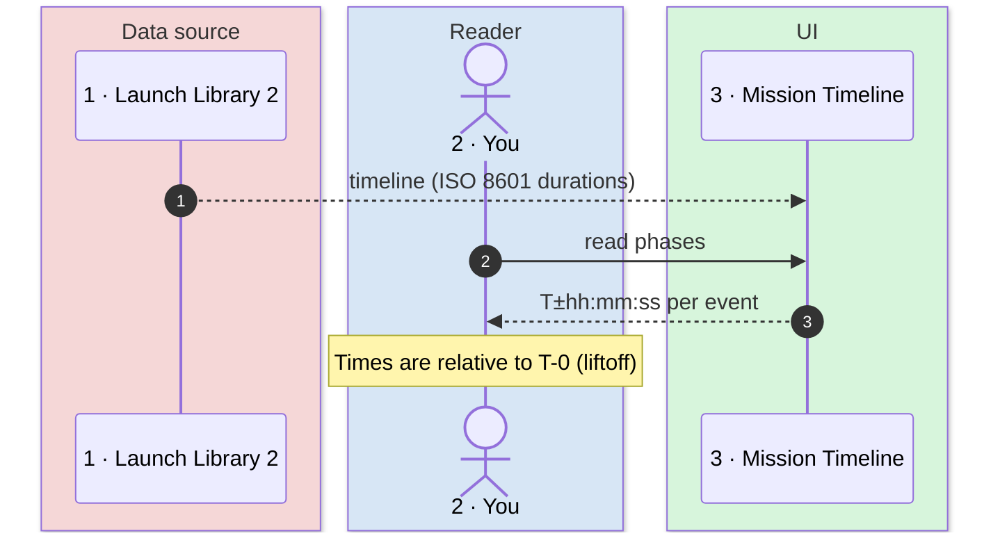

# Functional Analysis

What the UI shows, what each value means and how to read it. This document is
for users — not for developers.

## Table of Contents

- [SpaceX Launch Context](#spacex-launch-context)
- [UI Layout](#ui-layout)
- [Mission Panel](#mission-panel)
- [Launches Table](#launches-table)
- [Details Panel](#details-panel)
- [Mission Timeline Scatter](#mission-timeline-scatter)
- [Phases Panel](#phases-panel)
- [Reading the Timeline](#reading-the-timeline)
- [Cache and Freshness](#cache-and-freshness)
- [Operational Notes](#operational-notes)

## SpaceX Launch Context

A **SpaceX launch** is a rocket takeoff event — the moment the engines ignite and
the vehicle lifts off the pad. But a mission lasts hours: from pre-launch
preparations (prop loading, system checks) through flight (max Q, stage
separation, landing burn) to landing or payload deployment.

The application shows launches of a given **UTC day**, with their mission
phases (timeline of events before, during and after liftoff). Each launch has a
**Net Time** (T-0), the planned ignition time; phases are relative to it.

| Element | Meaning |
|---------|---------|
| **T-0** | Liftoff (ignition) |
| **T-hh:mm:ss** | Time before liftoff (countdown) |
| **T+hh:mm:ss** | Time after liftoff (flight) |
| **Mission** | The complete sequence from prep to landing/deployment |
| **Phase** | One named event in the mission (e.g., "Max Q", "Stage Separation", "Landing") |

## UI Layout



The application prints a box in the terminal with a header (title and count) and
a body with multiple panels. The default view is **dashboard** (all panels
visible in columns). The `--view panel` mode shows panels sequentially; `--view
compact` shows minimal content.

## Mission Panel

The panel shows one row:

| Content | Meaning |
|---------|---------|
| **"N SpaceX launch(es) on YYYY-MM-DD (UTC)"** | Number of launches on the selected day |
| **Time, name, status** (repeated per launch) | Each launch: T-0 time in UTC, rocket/mission name, status |

Status values are styled as follows:

| Status | Style | Meaning |
|--------|-------|---------|
| **Go** / **Success** | Bold green | Launch occurred successfully |
| **TBC** / **TBD** | Yellow | To Be Confirmed / To Be Determined |
| **In Flight** | Bold cyan | Launch is in progress (rare; usually cached) |
| **Hold** | Yellow | Launch held, not yet cleared to go |
| **Failure** | Bold red | Launch failed |
| **Partial Failure** | Red | Launch occurred but with degraded outcome |

Example:

```
2 SpaceX launches on 2026-09-28 (UTC)
10:00  Starship Flight 14                  Success
16:30  Falcon 9 Starlink Batch 6-127       Go
```

## Launches Table

A tabular view of all launches with columns:

| Column | Meaning |
|--------|---------|
| **T-0 (UTC)** | Liftoff time in ISO 8601 format (HH:MM or mm-dd HH:MM if outside the day) |
| **Name** | Mission name (e.g., "Starship Flight 14") |
| **Rocket** | Rocket configuration (e.g., "Starship", "Falcon 9") |
| **Pad** | Launch facility (e.g., "Starbase, Texas") |
| **Status** | Current status (see above) |

Times outside the UTC day being displayed are prefixed with `mm-dd` for clarity.

## Details Panel

Free-form text with additional information:

| Row | Field | Meaning |
|-----|-------|---------|
| **1** | Orbit | Target orbit or payload type (e.g., "Earth Orbit", "GTO", "Starlink Deployment") |
| **2** | Description | Mission objective (e.g., "In-flight abort test", "Crew rotation mission") |
| **3** | Window | Launch window: start and end times (e.g., "10:00 – 11:30 UTC") |

The description is truncated to 280 characters to fit on screen.

## Mission Timeline Scatter

An **ASCII grid** showing the mission phases of the **first launch of the day**,
projected onto a timeline. The scatter has three horizontal lanes:

| Lane | Events | Symbol |
|------|--------|--------|
| **Upper** | Countdown (before T-0) and ship flight (after T-0) | ■ and ◆ |
| **Center** | T-0 marker only | ▲ |
| **Lower** | Booster events (Stage 1 burn, landing, recovery) | ● |

The **horizontal axis** represents time relative to T-0, in a **logarithmic
scale** to balance early-flight events (minutes) with landing/recovery (hours).
The **horizontal position** is indicative — exact times are in the Phases panel
beside it.

### Reading the scatter

| Symbol | Color | Meaning |
|--------|-------|---------|
| **■** | White | Countdown event (before T-0) |
| **◆** | Cyan | Ship/vehicle event (after T-0) |
| **●** | Magenta | Booster event (Stage 1, landing, recovery) |
| **▲** | Yellow | T-0 (liftoff) |

Example: Starship Flight 14 (28 September 2026), 11 countdown events from
`T-00:50:00`, 19 ship events up to `T+09:50:30`, 5 booster events between
`T+00:02:20` and `T+00:07:01`:

```
■■ ■    ■■   ■■ ■    ◆ ◆   ◆  ◆◆◆     ◆◆

                ▲

                       ●● ●
```

### Why logarithmic time?

Early flight events (first few minutes) have spacing in seconds (max Q, stage
separation); landing happens hours later. A linear scale would compress early
events and make them unreadable. The logarithmic scale preserves readability
across the entire mission.

### Booster assignment

Events are classified as booster or ship based on keywords in their names:
`booster`, `boostback`, `stage 1`, `meco`. This happens only at or after T-0;
before liftoff, the vehicle is one.

If Launch Library 2 provides no timeline (common for future launches), three
minimal phases are synthesized: window start, net time (T-0), window end.

### Native viewer (graphical window, `T` key)

Below the ASCII scatter you see the line **`Press T to open the native mission
timeline viewer`** — it is a **keyboard action**. Press **`T`** to open the
timeline in a **graphical window**, **`Q`** to quit.

The window draws the phases on a **linear time axis**, one marker per event,
with the lanes clearly separated:

- **X axis**: time from T-0, with tick marks `T±h:mm`.
- **Y axis**: three lanes (Countdown, Ship, Booster) with colored markers and
  labels `name  T±hh:mm:ss`.
- **Interactions**: mouse wheel zooms around the cursor, drag pans, **R** resets,
  **ESC** closes.

It is a more faithful and readable view than the ASCII scatter, useful for
precision timing and visual inspection of the mission profile. It respects the
`--date` option and plots the first launch of that day.

Key listening is active only on an interactive terminal; with redirected output
(pipe/script) use the `--open-timeline` flag, which opens the viewer directly
and exits without waiting for `T`.

```powershell
python main.py                           # dashboard, then press T
python main.py --open-timeline           # opens the viewer directly
python main.py --date 2026-09-27 --open-timeline  # viewer for a past day
```

Requires Tkinter (bundled with Python on Windows). If it is unavailable, the
interactive loop prints a warning and keeps listening; with `--open-timeline`
the app prints an error and exits with code 4.

## Phases Panel

A list of all phases for the first launch, in chronological order:

```
T-00:50:00  GO for Prop Load
T-00:00:03  Ignition
T+00:00:00  Liftoff
T+00:00:58  Max-Q
T+00:02:20  MECO
T+00:02:22  Stage 2 Separation
T+00:07:01  Stage 1 Landing
T+09:50:30  Starship Landing
```

(An excerpt of Starship Flight 14.) Each line shows `T±hh:mm:ss  event name`,
with the exact timing of each phase. Booster events are intermixed
chronologically and use the lane colors: countdown dim, ship cyan, booster
magenta.

## Reading the Timeline



### Interpretation

- **Negative times (T-hh:mm:ss)**: events before liftoff (countdown). For example,
  `T-00:50:00  GO for Prop Load` is 50 minutes before liftoff.
- **Zero time (T+00:00:00)**: liftoff.
- **Positive times (T+hh:mm:ss)**: events after liftoff (flight). For example,
  `T+09:50:30  Starship Landing` is 9 hours, 50 minutes, 30 seconds after
  liftoff.

### Data freshness

The phases are fetched from Launch Library 2, a community-maintained database
updated as launches approach and occur. The timestamp shown in the Update panel
(bottom-right) is the time the data was fetched — not the liftoff time.

- **For today and future**: the cache expires after 10 minutes, so re-running the
  command will check for updates.
- **For past dates**: the cache is permanent (the mission has already occurred,
  so the timeline will not change).

Use `--refresh` to force a re-download of the latest data.

## Cache and Freshness

The application downloads launch data from Launch Library 2 once and saves it to
`cache/<date>.json` to avoid repeated API requests.

**On first run** (no cache):

```powershell
python main.py
# Fetches data from Launch Library 2 (a few seconds)
# Saves to cache/
# Prints the dashboard
```

**On later runs** (with a valid cache):

```powershell
python main.py
# Loads data from cache (instant)
# Prints the dashboard
```

**Cache expiry**:

- **For today, yesterday and future dates**: cache is considered stale after 10
  minutes and is re-downloaded on next run.
- **For past dates**: cache is permanent (data does not change).

**To force a re-download**:

```powershell
python main.py --refresh
python main.py --date 2026-09-27 --refresh  # past date, re-fetch anyway
```

**Offline mode** (cache only):

```powershell
python main.py --offline  # fails if cache missing
```

## Operational Notes

### No login required

Launch Library 2 is a public service. No API keys, accounts or credentials are
needed — the query is anonymous.

### Internet required on first run

- **Initial fetch**: launch data is downloaded from Launch Library 2 on first
  run. If the network is absent, the process fails with exit code 1.

Later runs (with a valid cache) do not require internet, unless `--refresh` is
used or the cache has expired.

### One-shot execution, not live

The application runs a sequence of operations, prints the result and exits. It
does not stay open, it does not continuously refresh. To update, re-run the
command.

### Terminal and UTF-8

The application forces **UTF-8** encoding on stdout/stderr at startup, to ensure
the Unicode markers (■, ◆, ●, ▲, →) print correctly even on a Windows console
(which defaults to cp1252). If reconfiguration fails, the process continues
anyway.

If you see garbled characters instead of ■ ◆ ●, your terminal may not support
UTF-8 or may use a font that lacks these symbols. Try:

1. Switching terminal (use Windows Terminal or VS Code, not cmd.exe)
2. Checking the terminal's language/encoding settings
3. Installing a symbol-rich font (e.g., Cascadia Code)

### Timestamps in UTC

All displayed timestamps (T-0, phase times, fetch time) are in **UTC**
(Coordinated Universal Time), the international standard time zone. They are not
converted to local time.

A launch scheduled for 10:00 UTC appears as `10:00 (UTC)` on the dashboard and
in the Launches table, regardless of your local timezone. The Launch Window
(start–end) is also in UTC.

### Redirected output and key listening

When output is redirected to a file or piped to another command, key listening
is disabled (the application cannot read from the terminal). Use the
`--open-timeline` flag to open the viewer without waiting for the `T` key:

```powershell
python main.py > output.txt          # no keys; prints and exits
python main.py --open-timeline       # opens viewer directly (exit code 0 or 4)
python main.py | tee output.txt      # no keys; prints and exits
```

### Rate limiting

Launch Library 2 enforces rate limiting on anonymous requests — typically a few
dozen requests per hour. The cache on disk avoids consuming your quota on
repeated runs.

### Adaptive layout

The dashboard layout adapts to terminal width. Use `--view` to change the
rendering mode:

```powershell
python main.py --view dashboard  # all panels (default)
python main.py --view panel      # panels stacked vertically
python main.py --view compact    # minimal content
```

On small terminals, some panels may stack automatically.
