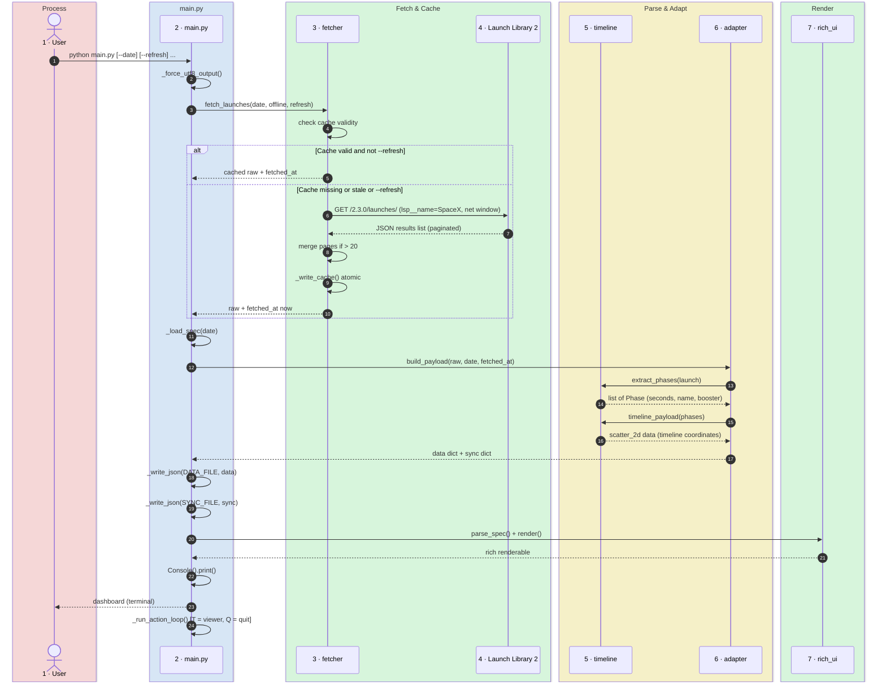

# Technical Analysis

How SpaceX Launches is built: components, data flow, parsing and caching.

## Table of Contents

- [Purpose](#purpose)
- [Architecture](#architecture)
- [Runtime Flow](#runtime-flow)
- [Components](#components)
  - [Fetcher & Cache](#fetcher--cache)
  - [Adapter](#adapter)
  - [Timeline Parser](#timeline-parser)
  - [DSL Rendering](#dsl-rendering)
  - [Keyboard Actions](#keyboard-actions)
  - [Native Mission Timeline Viewer](#native-mission-timeline-viewer)
- [External Feed and Parser](#external-feed-and-parser)
  - [Launch Library 2](#launch-library-2)
- [Configuration](#configuration)
- [Failure Modes](#failure-modes)

## Purpose

A one-shot terminal application, not a live loop. It queries **Launch Library 2**
for SpaceX launches on a given UTC day, parses their mission timelines (ISO 8601
relative durations), transforms them into the payload of a JSON DSL (the
**mahamudra-rich-ui** library) and renders them in the terminal as a dashboard
with launch table, details panel, mission timeline scatter and phase list.

## Architecture

```mermaid
flowchart LR
    subgraph External
        LL2["Launch Library 2 API<br/>(SpaceX launches + timelines)"]
    end

    subgraph Main
        M["main.py"]
        C["cache/<br/>YYYY-MM-DD.json"]
        F["fetch_launches()"]
        A["adapter.build_payload()"]
        R["render() via<br/>rich_ui"]
    end

    subgraph UI
        UI["vendor/rich-ui/<br/>(parse_spec, render)"]
    end

    LL2 -->|HTTP GET| F
    F -->|save| C
    C -->|load| F
    F --> A
    A --> R
    R -->|Console.print()| Terminal["Terminal<br/>(stdout UTF-8)"]
    UI --> R
```

A sequential, synchronous flow: cache check/load, network fetch if needed,
timeline parsing, DSL payload construction, spec loading, rendering via `rich`,
console print. No threads, no live updates — a static snapshot of the day's
launches.

## Runtime Flow



## Components

### Fetcher & Cache

**File**: `spacex_launches/fetcher.py`.

`fetch_launches()` queries LL2 with a filtered parameter set (see
[Launch Library 2](#launch-library-2)) and returns a `FetchResult` containing
the raw response and metadata.

**Cache strategy**:

- **For today, yesterday and future dates**: cache expires after 600 seconds and
  is refreshed on next call.
- **For past dates**: cache is permanent (immutable historical data).
- **On network failure**: if a cache exists, use it and return a warning.
- **On offline flag**: use cache only; raise an error if missing.
- **On refresh flag**: ignore cache and download.

**Pagination**: Launch Library 2 limits results to 20 per page. If a day has more
launches, the fetcher follows the `next` link up to 10 pages (max 200 launches)
and merges them into a single `results` list.

**Persistence**: `_write_cache()` uses the **tempfile + atomic rename** pattern
(via `Path.with_suffix` + `os.replace`) to guarantee the cache file is never
observed half-written (robust even if the process dies during JSON
serialization).

**HTTP timeout**: 30 seconds. `response.raise_for_status()` raises on 4xx/5xx.

### Adapter

**File**: `spacex_launches/adapter.py`.

Transforms the raw LL2 response into two dictionaries:

- **`data`**: payload bound to the spec `bind`s:
  - `mission`: text segments for the Mission panel (launch count, times, names,
    statuses).
  - `launches`: table records (T-0 UTC, name, rocket config, pad location,
    status).
  - `details`: text segments for the Details panel (description, window, orbit).
  - `timeline`: data structure for scatter_2d (phase coordinates + colors).
  - `phases`: list of `T±hh:mm:ss  event name` lines for the Phases panel.
  - `links`: links to official sources (mission page, rocket page, pad page).
  - `update`: freshness metadata (source, timestamp, refresh interval).

- **`sync`**: freshness metadata per bind — source, `updated_at` (ISO 8601),
  `interval_seconds`.

**Status styling**: each launch has a status (Go, Success, TBC, TBD, In Flight,
Hold, Failure, Partial Failure) which maps to a `rich` style (bold green for
success, yellow for uncertain, bold red for failure).

### Timeline Parser

**File**: `spacex_launches/timeline.py`.

Extracts mission phases from LL2's `timeline` field (a list of events with ISO
8601 durations relative to T-0) and produces:

1. **Phase list**: `Phase` objects (offset in seconds from T-0, event name,
   booster flag).
2. **Scatter coordinates**: for the terminal `scatter_2d` (radial display).

**Duration parsing**: ISO 8601 format (`-PT50M`, `PT1H4M50S`, `P0D`) is parsed
into seconds with sign (negative = countdown, positive = flight).

**Booster assignment**: events are classified as booster or ship based on
keywords in the name (`booster`, `boostback`, `stage 1`, `meco`), but only at or
after T-0. Before T-0 there is no booster distinction (single vehicle).

**Scatter lanes**: the terminal scatter has three horizontal lanes:

- **Upper**: countdown (■, left of T-0) and ship flight (◆, right of T-0).
- **Center**: T-0 marker (▲) only.
- **Lower**: booster (●).

**Log time scale**: time is mapped as `log1p(|seconds| / 10)` normalized to the
maximum offset. This preserves readability of early-flight events (minutes)
alongside landing events (hours). Raw coordinates are pre-distorted with the
inverse transform so the lanes appear straight on the radial scatter (which
applies `(d / L) ** 0.55`).

**Fallback phases**: if LL2 provides no `timeline` (common for future launches),
three minimal phases are synthesized from `window_start`, `net` (T-0), and
`window_end`.

### DSL Rendering

**File**: `main.py` (`_load_spec`, `parse_spec`, `render` calls).

The JSON spec (`specs/spacex.json`) is static and defines the layout: a frame
with a header slot (Mission panel, `bind=mission`) and a body slot (six-block
row: Launches table, Details panel, Mission Timeline scatter, Phases panel,
Links panel, Update panel).

The spec is loaded and the title is injected with the date:
`SpaceX Launches - YYYY-MM-DD (UTC)`.

The `rich_ui` library parses the spec and renders it into a `Frame` object,
which is then converted to a `rich` renderable and printed to the Console in
UTF-8.

### Keyboard Actions

**File**: `main.py` (`_run_action_loop`, `_collect_key_actions`).

The `scatter_2d` block in the spec declares an `Action` with `key: "T"`. The
`rich_ui` renderer shows it as *"Press T to open the native mission timeline
viewer"*. After rendering, `_run_action_loop` builds a `{key: Action}` map,
listens for key presses with `_read_action_key` (Windows: `msvcrt.getwch`;
elsewhere: `input()`) and executes the action:

- **T** → open native viewer
- **Q**, Enter, Esc or Ctrl+C → quit

The loop is active only when both `sys.stdin` and `sys.stdout` are real consoles
(checked via `isatty()` plus, on Windows, `GetConsoleMode`). With redirected
output, the `--open-timeline` flag opens the viewer directly without waiting for
the key.

### Native Mission Timeline Viewer

**File**: `spacex_launches/viewer.py`.

**Keyboard-action trigger**: launched by the `T` key or the `--open-timeline`
flag.

A dedicated **Tkinter plot** (not `show_scatter_window` from rich-ui, which draws
a polyline without a time axis). The viewer:

- **X axis**: linear time from T-0, with ticks `T±h:mm`.
- **Y axis**: three lanes (Countdown, Ship, Booster) with colored markers
  (white squares, cyan diamonds, magenta circles).
- **Labels**: `name  T±hh:mm:ss` per event, stacked on up to 4 levels to avoid
  overlap. If no level is free, the label is hidden (name shown on mouse hover
  in the status bar).
- **Dashed yellow line**: marks T-0.
- **Interactions**: mouse wheel zooms around the cursor, drag pans, **R** resets,
  **ESC** closes.

The viewer plots the **first launch of the selected day** (or the one
corresponding to `--open-timeline` when called directly).

**Failure handling**: if Tkinter is unavailable, a `RuntimeError` is caught; a
warning is printed in the interactive loop, or exit code 4 is returned if called
with the flag.

## External Feed and Parser

### Launch Library 2

**Endpoint**: `https://ll.thespacedevs.com/2.3.0/launches/`.

**Query parameters** (all paginated, ordering by `net`):

| Parameter | Value | Purpose |
|-----------|-------|---------|
| `lsp__name` | `SpaceX` | Organization filter |
| `net__gte` | YYYY-MM-DD T00:00:00Z | Window start |
| `net__lte` | YYYY-MM-DD T23:59:59Z | Window end |
| `limit` | `20` | Results per page |
| `mode` | `detailed` | Full launch object (includes `timeline`) |
| `ordering` | `net` | Sort by Net Time (T-0 timestamp) |

**Response**: JSON array of launch objects under `results`. Each object includes:

```
{
  "id": "...",
  "name": "Starship Flight 14",
  "net": "2026-09-28T10:00:00Z",
  "status": "Success",
  "window_start": "2026-09-28T10:00:00Z",
  "window_end": "2026-09-28T11:30:00Z",
  "rocket": { "configuration": { "name": "Starship", ... } },
  "pad": { "location": { "name": "Starbase, Texas", ... }, ... },
  "mission": { "description": "...", "type": "Human Crewed" },
  "timeline": [
    {
      "id": "...",
      "name": "Booster Landing",
      "relative_time": "PT10M30S"
    },
    ...
  ]
}
```

The `timeline` field is an array of events, each with an ISO 8601 relative
duration (`-PT50M` = T-50 minutes, `PT1H4M50S` = T+1h 4m 50s).

## Configuration

**File**: `spacex_launches/fetcher.py` and `spacex_launches/timeline.py`.

| Key | Value | Rationale |
|-----|-------|-----------|
| `LL2_LAUNCHES_URL` | `https://ll.thespacedevs.com/2.3.0/launches/` | API endpoint |
| `SOURCE_NAME` | `launch-library-2` | Data source identifier |
| `DEFAULT_CACHE_DIR` | `cache/` | Cache directory (relative to project) |
| `REQUEST_TIMEOUT_SECONDS` | `30` | HTTP timeout |
| `REFRESH_INTERVAL_SECONDS` | `600` | Cache TTL for recent dates (seconds) |
| `PAGE_SIZE` | `20` | LL2 results per page |
| `MAX_PAGES` | `10` | Max pages to fetch (limit 200 launches/day) |
| `LOG_SCALE_SECONDS` | `10.0` | Time scale reference for log mapping |
| `GRID_HALF_WIDTH` | `0.85` | Normalized scatter width (1.0 = edge) |
| `LANE_OFFSET` | `0.35` | Vertical lane separation on scatter |
| `DISPLAY_MAX_DISTANCE` | `100.0` | Arbitrary display units for scatter rescaling |

## Failure Modes

| Condition | Behaviour |
|-----------|-----------|
| **LL2 unreachable / HTTP timeout** | `requests.RequestException` caught in `main()` → `[error]` to stderr, exit code 1 |
| **LL2 returns HTTP 4xx/5xx** | `response.raise_for_status()` raises → same handling, exit code 1 |
| **Response missing `results` key** | `FetchError` in `_get_json()` → exit code 1 |
| **Invalid JSON in response** | `ValueError` in `_get_json()` → exit code 1 |
| **Cache missing in offline mode** | `FetchError` in `fetch_launches()` → exit code 1 |
| **Corrupted cache file** | Defensive load fails, file is re-downloaded → exit code 1 if no network |
| **Invalid ISO 8601 duration** | Parsing fails, phase skipped (fallback to window times) |
| **No launches on the day** | Empty results list → "No launches" message in Mission panel, viewer unavailable |
| **Process killed during _write_cache()** | Atomic rename — previous file stays valid (consistency guaranteed) |
| **Windows cp1252 console** | Mitigated by `_force_utf8_output()` which reconfigures stdout/stderr to UTF-8 where possible |
| **Tkinter unavailable (viewer)** | `ImportError` caught → `[yellow]Viewer unavailable[/yellow]` message in interactive loop, or exit code 4 with `--open-timeline` |
| **Malformed timeline payload (viewer)** | `KeyError`/`TypeError` converted to `RuntimeError` → same handling |
| **Missing bind in data** | `find_data_issues()` prints a `[warning]` to stderr; the render proceeds anyway |
| **--offline and --refresh both set** | Mutually exclusive; `argparse` rejects both |
